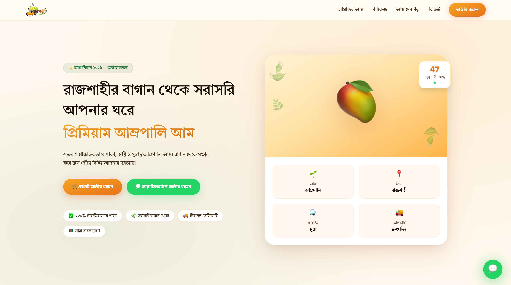

# আম পল্লী (Aam Polli)

🥭 Bengali direct-to-consumer mango ordering storefront

👨‍💻 **Role:** Full-Stack Developer

🚧 **Status:** MVP / Prototype — not yet production-ready (see limitations below)

---

## Overview

আম পল্লী is a Bengali-language storefront built for a Rajshahi-based mango business. It lets customers browse mango packages, place a cash-on-delivery order, and follow up over WhatsApp — with an admin API concept for managing incoming orders.

This is a **direct-order MVP**, not a full marketplace or SaaS product: no payment gateway, no customer accounts, and no persistent database yet. It's built to validate a real, localized ordering workflow for a small business.

**Who it's for:**
- Customers in Bangladesh ordering mangoes online
- Business staff managing orders through the admin API
- The business owner coordinating phone/WhatsApp/cash-on-delivery fulfillment

---

## What I Built

### Customer Experience

- Bengali-language storefront with a hero section, product packages, and pricing
- Order form: name, Bangladesh phone number, package selection, delivery address, optional note
- Client-side and server-side form validation
- Cash-on-delivery messaging and a generated order ID on submission
- WhatsApp follow-up message after order placement
- About, contact, and FAQ pages
- Customer reviews, product benefits, and delivery info sections
- Responsive layout with a mobile sticky order/WhatsApp bar and floating WhatsApp button
- Toast notifications and accessible, labeled forms

### Admin (API Concept)

- Password-protected admin API for order management: list, filter by status, retrieve, update status, delete
- Order status aggregation/statistics endpoint
- *(Note: this is currently API-only — there is no working admin dashboard UI yet.)*

---

## Tech Stack

| Category | Technologies |
|---|---|
| Frontend | Next.js 14 (App Router), React 18, Tailwind CSS 3 |
| Backend (active) | Next.js Route Handler (`/api/orders`) |
| Backend (legacy) | Separate Express 4 server (`server.js`) with admin order routes |
| Language | JavaScript / JSX (no TypeScript yet) |
| Fonts | Hind Siliguri & Tiro Bangla (Bengali typography) |
| Icons | lucide-react |
| Integrations | WhatsApp deep links, optional generic SMS API |

---

## Architecture

```
app/           → Next.js pages, layouts, and the active order API route
components/    → Hero, Products, OrderForm, Navbar, Footer, Button, Card, etc.
config.js      → contact info, package data, social links, UI copy
server.js      → separate legacy Express server (admin order API + page builder)
```

**Active order flow (Next.js):**

```
OrderForm (client) → POST /api/orders → validator → orderService → Order model (in-memory)
                                                              ↓
                                                   optional SMS notification
                                                              ↓
                                            response → WhatsApp follow-up opens
```

> ⚠️ There are currently **two backend paths** — the active Next.js route handler, and a separate legacy Express server with its own `/api/orders` and `/api/admin` routes. They don't share a database and would conflict if run on the same port. Consolidating these into one backend is the top architectural priority.

---

## Data Model

**Order** (currently an in-memory JavaScript array, not a database):

| Field | Description |
|---|---|
| `_id` | Generated UUID |
| `orderId` | Sequential human-readable ID, e.g. `VB-2026-0001` |
| `name`, `phone`, `address`, `note` | Customer-submitted fields |
| `package` | One of `5kg`, `10kg`, `20kg` |
| `status` | `pending`, `confirmed`, `delivered`, `cancelled` |
| `createdAt` | ISO timestamp |

Validation (required fields, package allowlist, phone format, address length) is handled in a dedicated validator layer, separate from the model itself.

---

## Engineering Notes — Known Limitations

This is presented honestly as an early-stage prototype. Known issues:

- **No persistent database** — orders are stored in a module-level in-memory array and are lost on every restart or redeploy
- **Two overlapping backends** — the Next.js API route and the legacy Express server duplicate order-handling logic without sharing state
- **Package catalog inconsistency** — product cards advertise 11/22/44 kg, the order form shows 10/20/40 kg, and the backend only accepts `5kg`/`10kg`/`20kg` — these need to be unified into a single source of truth
- **Broken query-string preselection** — package selection links place `?pkg=` after the URL hash, so it isn't read correctly by the form
- **Admin auth is a shared plaintext password** compared directly against an environment variable, sent as a header on every request — no sessions, tokens, or expiry
- **No rate limiting, CSRF protection, or restricted CORS** — the public order endpoint and admin endpoints are unprotected against abuse
- **No working admin dashboard UI** — only the underlying API exists; the legacy page-builder references view files that aren't present in the repo
- **Some content is hard-coded** — customer counts, ratings, and reviews are static presentation values, not backed by real data
- **No automated tests, CI, or deployment configuration**

## Screenshots

### Homepage


---

## 🔒 Client Confidentiality

This is a client-owned production application.

The source code is private and is not included in this repository.

This repository is a public case study containing only information and visual materials that can be publicly shared.

---

## 🌐 Live Project

**Sagorix-Media**
https://www.aampolli.com/

---

## 👨‍💻 Developer

**Fuad Hasan**
Full-Stack Developer
Next.js • React • TypeScript • Node.js • MongoDB

🌐 Portfolio: [fuadhasan.dev](https://www.fuadhasan.dev/)
💼 LinkedIn: [linkedin.com/in/fuadhasandev](https://linkedin.com/in/fuadhasandev)